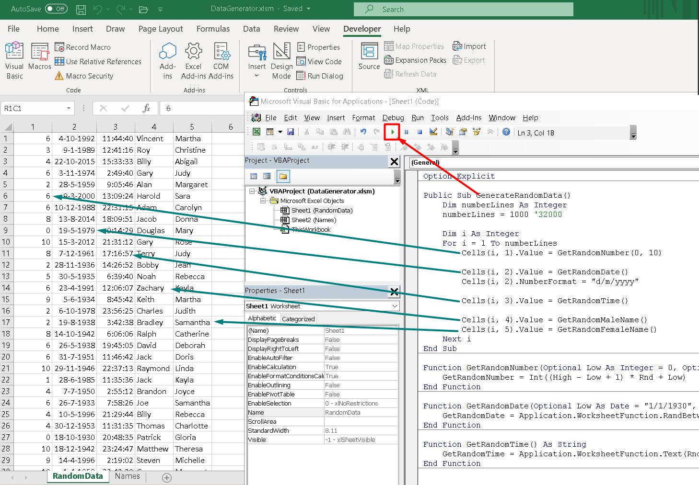

This xlsm-file contains functions to create random data: Integer, Date, Time, Names (Male and Female) and Couples of Words.  
You can add any functions to generate different type of data



```
Option Explicit

Public Sub GenerateRandomData()
    Dim numberLines As Integer
    numberLines = 1000 '32000

    Dim i As Integer
    For i = 1 To numberLines
        Cells(i, 1).Value = GetRandomNumber(0, 10)
        
        Cells(i, 2).Value = GetRandomDate()
        Cells(i, 2).NumberFormat = "d/m/yyyy"
        
        Cells(i, 3).Value = GetRandomTime()
        
        Cells(i, 4).Value = GetRandomMaleName()
        Cells(i, 5).Value = GetRandomFemaleName()
        
        Cells(i, 6).Value = GetRandomCoupleOfWords()
    Next i
End Sub

Function GetRandomNumber(Optional Low As Integer = 0, Optional High As Integer = 1) As Integer
    GetRandomNumber = Int((High - Low + 1) * Rnd + Low)
End Function

Function GetRandomDate(Optional Low As Date = "1/1/1930", Optional High As Date = "1/1/2021") As Date
    GetRandomDate = Application.WorksheetFunction.RandBetween(Low, High)
End Function

Function GetRandomTime() As String
    GetRandomTime = Application.WorksheetFunction.Text(Rnd(), "HH:MM:SS")
End Function

Function GetRandomMaleName() As String
    Dim lRow As Integer
    Dim i As Integer
    Dim colIndex As Integer
    colIndex = 2
    
    With ThisWorkbook.Worksheets("Names")
        lRow = .Cells(Rows.Count, colIndex).End(xlUp).Row
        i = Application.WorksheetFunction.RandBetween(4, lRow)
        GetRandomMaleName = .Cells(i, colIndex).Value
    End With
End Function

Function GetRandomFemaleName() As String
    Dim lRow As Integer
    Dim i As Integer
    Dim colIndex As Integer
    colIndex = 4
    
    With ThisWorkbook.Worksheets("Names")
        lRow = .Cells(Rows.Count, colIndex).End(xlUp).Row
        i = Application.WorksheetFunction.RandBetween(4, lRow)
        GetRandomFemaleName = .Cells(i, colIndex).Value
    End With
End Function

Function GetRandomCoupleOfWords() As String
    Dim lRow As Integer
    Dim i As Integer
    Dim Word1, Word2 As String
    
    With ThisWorkbook.Worksheets("Words")
        lRow = .Cells(Rows.Count, 2).End(xlUp).Row
        i = Application.RandBetween(2, lRow)
        
        Word1 = Application.Proper(.Cells(i, 2).Value)
        
        lRow = .Cells(Rows.Count, 2).End(xlUp).Row
        i = Application.RandBetween(2, lRow)
        Word2 = Application.Proper(.Cells(i, 2).Value)
        
        GetRandomCoupleOfWords = Word1 & " " & Word2
    End With
End Function
```


